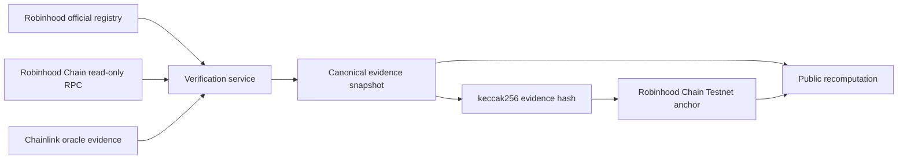

# Architecture

The competition slice has four independent layers:

1. **Read-only chain inspection** validates the configured chain ID, fixes a block context, confirms bytecode, and reads bounded ERC-20 fields through an allowlist of JSON-RPC methods.
2. **Official identity** matches both chain ID and normalized contract address against Robinhood's official asset registry. Token name and symbol alone never establish identity.
3. **Evidence integrity** keeps Robinhood reference values, Chainlink oracle observations, and observed-market evidence separate. Missing data remains unavailable rather than being synthesized.
4. **Evidence Anchor** canonicalizes a versioned JSON snapshot, hashes it with a domain separator, and commits only the hash, asset key, schema version, attestor, and timestamp on Robinhood Chain Testnet.

The canonical format is `TA-EVIDENCE-V1`. Object keys are sorted lexicographically, arrays retain order, timestamps normalize to ISO-8601 UTC milliseconds, EVM addresses normalize to lowercase, and decimal financial values remain strings. Floating-point numbers are rejected.
